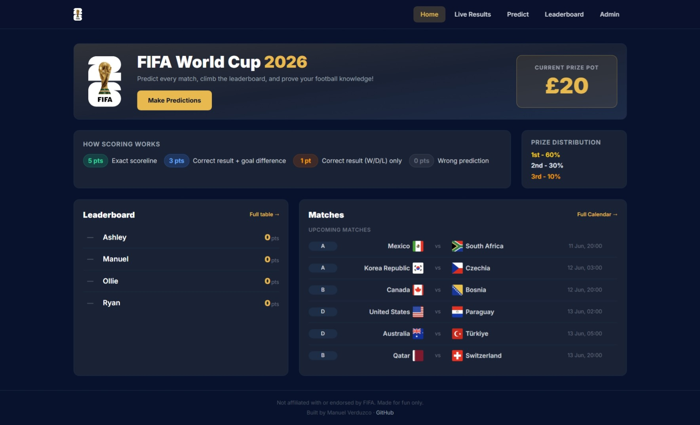

# WC 2026 Predictor

A full-stack World Cup 2026 prediction game for friend groups. Predict every scoreline, earn points for accuracy, and compete on a live leaderboard — with a real prize pot on the line.

**[Live Demo →](https://wc2026-predictor-7zl6.onrender.com/)**



---

## Features

- **Predict** scorelines for all 72 group stage matches before they kick off
- **Live leaderboard** with tiebreaks across 5 criteria — auto-refreshes every minute
- **Scoring** — 5pts exact scoreline · 3pts correct result + GD · 1pt correct result · 0pts wrong
- **Live results** — Groups standings, full match calendar, and knockout bracket updated in real time
- **Prize pot** — tracks the pot and displays 1st/2nd/3rd distribution to players
- **Admin panel** — enter results, manage knockout rounds, sync live scores, recalculate standings
- **Knockout bracket** — auto-resolves R32 slots from live group standings including Annexe C best-3rd-place logic

---

## Tech Stack

| Layer | Tech |
|---|---|
| Frontend | React 18 + Vite + Tailwind CSS |
| Backend | Node.js + Express |
| Database | SQLite via Node's built-in `node:sqlite` (v22.5+, no native compilation) |
| Routing | React Router v6 |

---

## Scoring System

| Result | Points |
|---|---|
| Exact scoreline | 5 pts |
| Correct result + goal difference | 3 pts |
| Correct result (W/D/L) only | 1 pt |
| Wrong prediction | 0 pts |

Tiebreaks (in order): total points → exact scorelines → correct result+GD → correct result only → fewest wrong predictions.

---

## Getting Started (Local Dev)

### Prerequisites

- **Node.js v22.5+** (required for `node:sqlite`)

### Install

```bash
npm run install:all
```

### Seed the database

```bash
npm run seed
```

### Run in development

```bash
# Terminal 1 — API server (port 3001)
npm run dev:server

# Terminal 2 — Vite dev server (port 5173)
npm run dev:client
```

### Environment variables

Create a `.env` file in the project root:

```env
PORT=3001
ADMIN_KEY=your_secret_key
DB_PATH=../data/wc2026.db
```

---

## Deploying to Render

[Render](https://render.com) is the recommended host. The **Starter plan** (~$7/month) includes the persistent disk required for SQLite. The free tier resets the disk on every deploy — not suitable for production.

1. Push your repo to GitHub
2. Create a new **Web Service** on Render and connect the repo — `render.yaml` auto-fills all settings
3. Set `ADMIN_KEY` in the Render **Environment** tab
4. Deploy — Render installs deps, builds the frontend, mounts the disk, seeds the DB on first boot, and starts the server

Every `git push` to `main` triggers a redeploy. The SQLite database lives on the persistent disk and survives deploys.

---

## Project Structure

```
wc2026-predictor/
├── client/                  # React frontend (Vite)
│   └── src/
│       ├── pages/
│       │   ├── Home/            # Landing page
│       │   ├── LiveResults.jsx  # Groups / Calendar / Bracket tabs
│       │   ├── Predict.jsx      # Prediction form
│       │   ├── Leaderboard.jsx  # Full player rankings
│       │   └── Admin/           # Score entry + knockout management
│       └── bracketUtils.js      # Slot definitions + standings logic
│
├── server/
│   └── src/
│       ├── routes/          # matches, predictions, leaderboard, admin
│       ├── bracketUtils.js  # Server-side R32 recalculation
│       ├── db.js            # SQLite init + compat shim
│       └── scoring.js       # Points calculation
│
├── seed.js                  # Seeds 48 teams + 72 group stage matches
└── world-cup-2026-schedule.json
```

---

## Database Schema

```sql
teams       (id, name, code, group_name, flag_emoji)
matches     (id, home_team_id, away_team_id, match_date, venue,
             phase, group_name, home_score, away_score, status, match_number)
users       (id, name, created_at, submitted_at)
predictions (id, user_id, match_id, pred_home, pred_away, points)
```

---

*Not affiliated with or endorsed by FIFA. Made for fun only.*
